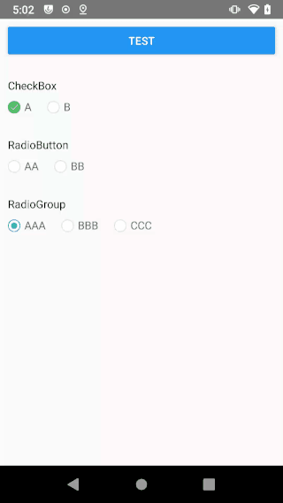

# react-native-radio-check

* Support Android and IOS
* Similar to RadioButton and CheckBox int Android 

## Install

`$ yarn add react-native-radio-check`

or

`$ npm install react-native-radio-check --save`

## Import

`import { CheckBox, RadioButton, RadioGroup } from "react-native-radio-check"`

## Props

#### RadioButton
| Props            | Type                  | Desc                                                         | Default   |
| :--------------- | :-------------------- | ------------------------------------------------------------ | --------- |
| style            | StyleProp<ViewStyle>  | Sets the style of button.                                    | undefined |
| icon             | RadioIcon             | Sets normal and checked icons.                               | undefined |
| iconStyle        | StyleProp<ImageStyle> | Sets the style of icon .                                     | undefined |
| text             | string                | Sets the text of button                                      | undefined |
| textStyle        | StyleProp<TextStyle>  | Sets the style of text                                       | undefined |
| textCheckedStyle | StyleProp<TextStyle>  | Sets the style of text when checked.                         | undefined |
| id               | number                | Sets the id of button, this prop needs to be used with RadioGroup. | undefined |
| value            | any                   | This prop needs to be used with RadioGroup，you can set a added value. | undefined |
| checked          | boolean               | Sets checked state of button.                                | undefined |
| disabled         | boolean               | if true, user not to tap the button.                         | undefined |
| onChecked        | function              | Handler to be called when changing checked state.            | undefined |

#### RadioGroup
| Props            | Type                  | Desc                                              | Default   |
| :--------------- | :-------------------- | ------------------------------------------------- | --------- |
| style            | StyleProp<ViewStyle>  | Sets the style of component.                      | undefined |
| icon             | RadioIcon             | Sets normal and checked icons of sub RadioButton. | undefined |
| iconStyle        | StyleProp<ImageStyle> | Sets icon style of sub RadioButton.               | undefined |
| textStyle        | StyleProp<TextStyle>  | Sets text style of sub RadioButton.               | undefined |
| textCheckedStyle | StyleProp<TextStyle>  | Sets text style of sub RadioButton when checked.  | undefined |
| checkedId        | number                | Sets the id of current checked sub RadioButton.   | undefined |
| onChecked        | function              | Handler to be called when changing checked state. | undefined |

#### CheckBox

Refer to RadioButton

## Example

```javascript
<RadioButton
  icon={{
    ormal: require('./icon/ic_normal.png'),
    checked: require("./icon/ic_radio_check.png")
   }}
   textStyle={{ marginLeft: 5 }}
   text="AA"
   onChecked={(checked, pressed) => {

   }} />

<RadioGroup
  style={{ flexDirection: 'row', marginTop: 10 }}
  checkedId={this.state.index}
  icon={{
    normal: require('./icon/ic_normal.png'),
    checked: require("./icon/ic_radio_check.png")
  }}
  textStyle={{ marginLeft: 5 }}
  onChecked={(id, value) => {
    console.info("Group===", id)
    console.info("Value===", value)
  }}>
  <RadioButton
    text="AAA"
    value={1} />
  <RadioButton
    style={{ marginLeft: 20 }}
    text="BBB"
    value={2} />
</RadioGroup>

<CheckBox
  checked={this.state.check}
  icon={{
    normal: require('./icon/ic_normal.png'),
    checked: require("./icon/ic_check.png")
  }}
  textStyle={{ marginLeft: 5 }}
  text="A"
  onChecked={(checked, pressed) => {

  }} />
```


